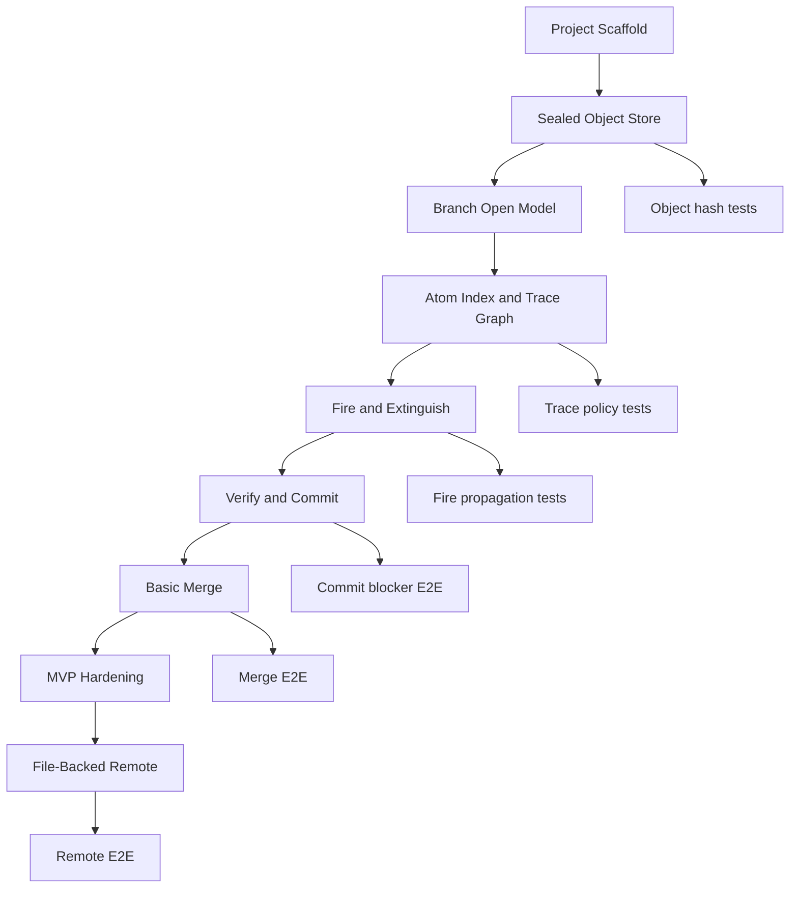

# CodeFire Completion Plan

この計画は、`CodeFire Documentation v0.2` を実装可能なMVPへ進めるための完成計画です。

## Completion Goal

MVPの完成状態は、次のシナリオがローカルで再現できることです。

```text
1. codefire init
2. mainをopen
3. 仕様・設計・Pythonコード・pytestテストを配置
4. Trace Linkを定義
5. verifyしてcommit
6. mainからfeatureをclone
7. featureをopen
8. コード変更で関連Atomへfireを立てる
9. open fireが残る状態でcommitを拒否する
10. 仕様・設計・テスト更新、またはno-change-required理由でfireをextinguishする
11. verify成功後にsealed commitを作る
12. featureをmainへmergeし、merge fire解消後にmerge commitを作る
```

## Scope

MVPで作るもの:

- Local repository and object store
- Branch object and sealed branch head
- `open`, `close`, `clone`
- Markdown / OpenAPI / DB schema / Python / JavaScript / TypeScript / Go / Java / C# / Rust / Kotlin / PHP / Ruby / Swift / C/C++ / pytest Atom extraction
- `codefire.yaml`, `codefire.links.yaml`, `codefire.policy.yaml`
- Trace Graph and required link policy
- `scan`, auto fire, manual fire, obsolete fire
- `extinguish`, resolution basis, stale resolution
- `verify`, external command runner, consistency certificate
- `commit`, commit sealing, branch head update
- Basic merge with merge fire
- File-backed remote upload/list/clone/show/diff
- HTTP/HTTPS remote transport
- Merge request create/list/review/apply
- Server-side sealed commit validation and verification command
- Permission policy, branch protection, token authentication, commit/request signatures, remote GC retention

MVPで作らないもの:

- AI integration
- GUI
- Advanced semantic merge
- Hosted server isolation
- Public-key signing, external KMS integration, package-index release

## Milestones

### M0: Project Scaffold

Goal: 実装を継続できる土台を作る。

- 実装先を確定する。
- CLI skeletonを作る。
- fixtures / golden tests / E2E tests の置き場を作る。
- 最初のデモfixtureを作る。

Exit criteria:

- `codefire --help` が実行できる。
- テストコマンドが1つに決まっている。
- CIまたはローカル確認コマンドが明記されている。

### M1: Sealed Object Store

Goal: CodeFireの「整合済み状態だけが保存される」基盤を作る。

- canonical serialization
- hash calculation
- immutable object store
- manifest / commit / branch object
- `codefire init`
- empty main branch

Exit criteria:

- repositoryをinitできる。
- 空のmain branch headを作れる。
- objectを書き込み、hash検証できる。

### M2: Branch Open Model

Goal: checkoutではなく、branchを実ディレクトリとしてopenするモデルを実装する。

- `open`
- `.codefire-open`
- open registry
- copied directory detection
- `close`, `close --discard`
- local `clone`

Exit criteria:

- mainをopenできる。
- mainからfeature branchを作れる。
- 同一branch多重openを拒否できる。
- open-clean branchをcloseできる。

### M3: Atom Index and Trace Graph

Goal: 成果物をAtom単位で扱い、Trace Linkを検証できるようにする。

- config parsers
- Markdown Atom extractor
- Python Atom extractor
- pytest Atom extractor
- AtomIndex
- duplicate Atom ID detection
- TraceGraph
- required link policy

Exit criteria:

- REQ / DES / CODE / TEST Atomを抽出できる。
- duplicate Atom IDを検出できる。
- required link欠落でverifyまたはcommitを拒否できる。

### M4: Fire and Extinguish

Goal: 変更により確認責任を立て、根拠付きで解消できるようにする。

- `scan`
- changed atom detection
- fire propagation
- active fire ledger
- obsolete auto fire
- manual fire
- `extinguish`
- resolution basis
- stale resolution

Exit criteria:

- code変更で関連するdesign / requirement / testへfireが立つ。
- open fireがcommit blockerになる。
- revertでauto fireがobsoleteになる。
- manual fireは自動obsoleteにならない。
- stale resolutionがcommit blockerになる。

### M5: Verify and Commit

Goal: fireなし、staleなし、link欠落なし、verification成功の状態だけsealed commitにする。

- verification command runner
- internal policy checks
- verification object
- commit sealer
- consistency certificate
- branch head update
- active state reset

Exit criteria:

- open fireが0の場合だけcommitできる。
- pytest失敗時にcommitを拒否できる。
- commit後にbranch headが進む。
- commit後にopen stateがopen-cleanになる。

### M6: Basic Merge

Goal: sealed branch同士を統合し、merge後の確認責任をfireとして扱う。

- common ancestor search
- file-level 3-way merge
- atom-level diff
- merge fire
- merge commit parents

Exit criteria:

- featureをmainへmergeできる。
- merge後mainがopen-burningになる。
- fire解消後にparentsが2つのmerge commitを作れる。

### M7: MVP Hardening

Goal: デモ可能な完成度へ整える。

- `codefire doctor` minimal checks
- error message cleanup
- README / runbook更新
- known limitations整理
- E2E demo script

Exit criteria:

- MVPデモシナリオが最初から最後まで通る。
- 失敗時の原因がCLI出力から判断できる。
- v0.3へ残す課題が文書化されている。

### M8: File-Backed Remote

Goal: network protocolなしでremote semanticsを検証できるfile-backed serverを実装する。

- upload/list/remote clone
- remote show/diff
- merge request create/list/review/apply
- sealed commit validation
- server-side verification command
- permission policy
- token authentication
- object GC and retention policy

Exit criteria:

- sealed commitだけをremoteへuploadできる。
- non-fast-forward uploadを拒否できる。
- approved merge requestをfast-forward条件でapplyできる。
- mutating operationをactor permissionとtokenで制御できる。
- 到達不能objectをGCでき、保持期間内のobjectを保護できる。

## Dependency DAG



## Critical Path

Critical path:

```text
Project Scaffold
  -> Object Store
  -> Open Directory Identity
  -> Atom Index
  -> Trace Graph
  -> Fire Ledger
  -> Extinguish/Stale
  -> Verify
  -> Commit Sealer
  -> Merge
  -> File-Backed Remote
```

Parallelizable work:

- CLI help/error formatting can proceed after M0.
- schema parser tests can proceed before full repository operations.
- documentation/runbook updates can proceed alongside all milestones.
- `doctor` can begin once repository layout and open registry are fixed.

## Testing Strategy

- Unit tests:
  - canonical serialization
  - hash calculation
  - Atom extraction
  - TraceGraph validation
  - fire key de-duplication
  - stale resolution basis comparison
- Integration tests:
  - init/open/close/clone
  - scan with changed atoms
  - verify policy checks
  - commit sealing and branch head update
- E2E tests:
  - first sealed commit
  - code change creates fire and blocks commit
  - extinguish allows commit
  - merge creates fire and then merge commit

## Risk Controls

- Fire fatigue:
  - MVP propagationは直接接続Atomに限定する。
  - fire keyで重複を抑止する。
- Heavy commit:
  - E2E fixtureは小さく保つ。
  - verification commandはMVPではpytest 1系統に限定する。
- OS copy checkpoint:
  - `.codefire-open` と open registry の不一致を早期に拒否する。
- Git culture mismatch:
  - CLI helpに「存在しない操作」を明示する。
  - close/discardの意味をREADMEに明記する。

## First Implementation Sprint

最初に着手する順序:

1. CF-000: 実装先と採用言語を確定する。
2. CF-001: project scaffoldを作る。
3. CF-003: demo fixtureとテストディレクトリを作る。
4. CF-010: canonical serializationのテストを書く。
5. CF-011: object hash calculationを通す。
6. CF-012: immutable object storeを作る。
7. CF-020: `codefire init` を実装する。

最初の完了条件:

- `codefire init` が `.codefire/` を作る。
- object store に1つのcommit objectを書ける。
- hash mismatchを検出できる。
- テストコマンドが通る。
